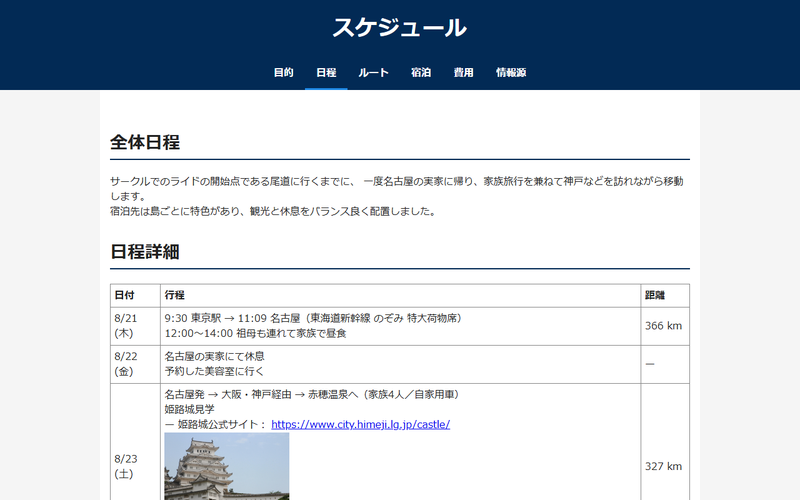

# ロードバイクサークル夏合宿 in しまなみ海道

東京理科大学ロードバイクサークル（TUSCC）の夏季合宿計画をまとめた静的 Web サイトです。
瀬戸内海を渡る「しまなみ海道」を自転車で走破するルートや、日程・宿泊・費用をわかりやすく整理しています。

---

## スクリーンショット

> **TODO:** 実際のスクリーンショットを追加してください。

| トップページ | 日程ページ |
|---|---|
|  |  |

---

## プロジェクト概要

| 項目 | 内容 |
|---|---|
| サークル | 東京理科大学ロードバイクサークル（TUSCC） |
| 合宿期間 | 2025年8月21日（木）〜 8月27日（水） |
| メインコース | 尾道 → 今治（しまなみ海道 約70km） → 松山（はまかぜ海道 約65km） |
| 総予算（目安） | 約56,050円 |

### ページ構成

| ファイル | 内容 |
|---|---|
| `index.html` | 旅行の目的・持ち物・諸注意 |
| `schedule.html` | 日程詳細（8/21〜8/27） |
| `route.html` | 移動ルートと Google Maps 埋め込み |
| `lodging.html` | 宿泊先一覧（銀波荘 / しーそー / サンライズ糸山 / 松山ニューグランドホテル） |
| `cost.html` | 費用内訳 |
| `sources.html` | 参考情報源 |

---

## セットアップ手順

このプロジェクトはビルドツール不要の純粋な静的 HTML/CSS サイトです。
ローカルで確認するには、以下の手順に従ってください。

### 1. リポジトリをクローン

```bash
git clone https://github.com/takumayellow/summer-ride-plan.git
cd summer-ride-plan
```

### 2. ローカルサーバーを起動（推奨）

`file://` で直接開くと Google Maps の iframe が正常に表示されないことがあるため、簡易サーバーを使用することを推奨します。

```bash
# Python 3 の場合
python3 -m http.server 8080

# Node.js (npx) の場合
npx serve .
```

### 3. ブラウザで開く

```
http://localhost:8080
```

> ファイルを直接ブラウザにドラッグ＆ドロップするだけでも基本的なレイアウトは確認できます。

---

## 使い方

ブラウザでサイトを開くと、ナビゲーションバーから各ページへ移動できます。

- **目的** (`index.html`) — 合宿の目的・チームビルディングの意義・持ち物リストを確認
- **日程** (`schedule.html`) — 8日間の移動・観光・ライドスケジュールを確認
- **ルート** (`route.html`) — 出発から帰宅までのルートと Google Maps で地図を確認
- **宿泊** (`lodging.html`) — 各宿泊先の詳細情報と地図を確認
- **費用** (`cost.html`) — 交通費・宿泊費・食費の内訳を確認

---

## 技術スタック

| 技術 | 用途 |
|---|---|
| HTML5 | マークアップ（全 6 ページ） |
| CSS3 | スタイリング（`common/css/plan.css`） |
| CSS カスタムプロパティ | カラーパレット管理 |
| CSS Sticky Positioning | スクロール連動ナビゲーション |
| CSS Animation (`@keyframes`) | ヒーローセクションのフェードインアニメーション |
| Vanilla JavaScript | スクロールに応じた nav クラス付け替え |
| Google Maps Embed API | ルートページと宿泊ページの地図埋め込み |

### ファイル構成

```
summer-ride-plan/
├── index.html          # トップページ（旅行の目的）
├── schedule.html       # 日程詳細
├── route.html          # 移動ルート・地図
├── lodging.html        # 宿泊先一覧
├── cost.html           # 費用内訳
├── sources.html        # 参考情報源
└── common/
    ├── css/
    │   └── plan.css    # 共通スタイルシート
    └── images/
        ├── himejicastle.jpg      # 姫路城の写真（Photo by Sam Schiro on Pexels, CC0）
        └── kurushimabridge.jpg   # 来島海峡大橋の写真（Photo by Meinen Ryu on Pexels, CC0）
```

---

## ライセンス

本リポジトリのコードは TUSCC 内部向け資料として作成されました。
画像素材は [Pexels](https://www.pexels.com/) の CC0 ライセンス素材を使用しています。
